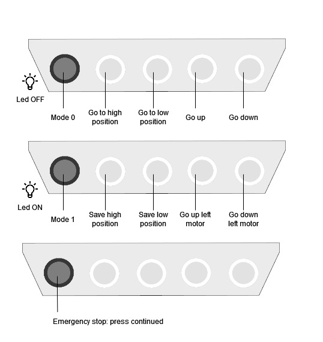
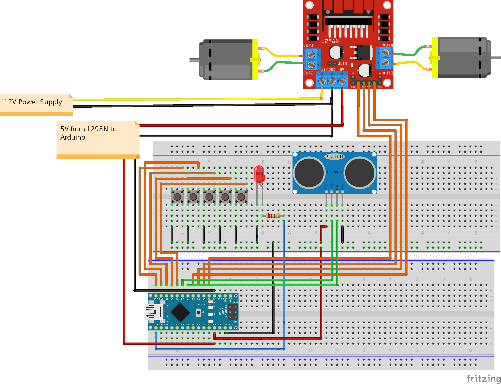

# Standing desk

Standing desk controller for Arduino:
- https://www.thingiverse.com/thing:6367171
- Video: https://x.com/Zerrotajo/status/1685781802013634560

### Modes

### Circuit

### Requirements:

- Arduino Nano x1.
- L298N x1.
- Button PBS-33B x5
- Led 5mm x1.
- Resistance 220
- HC-SR04 Ultrasonic Distance Sensor x1.
- [VEVOR Linear actuator 12V 50.8CM 900N 10 mm/s](https://a.aliexpress.com/_EwHOAv7) x2.

